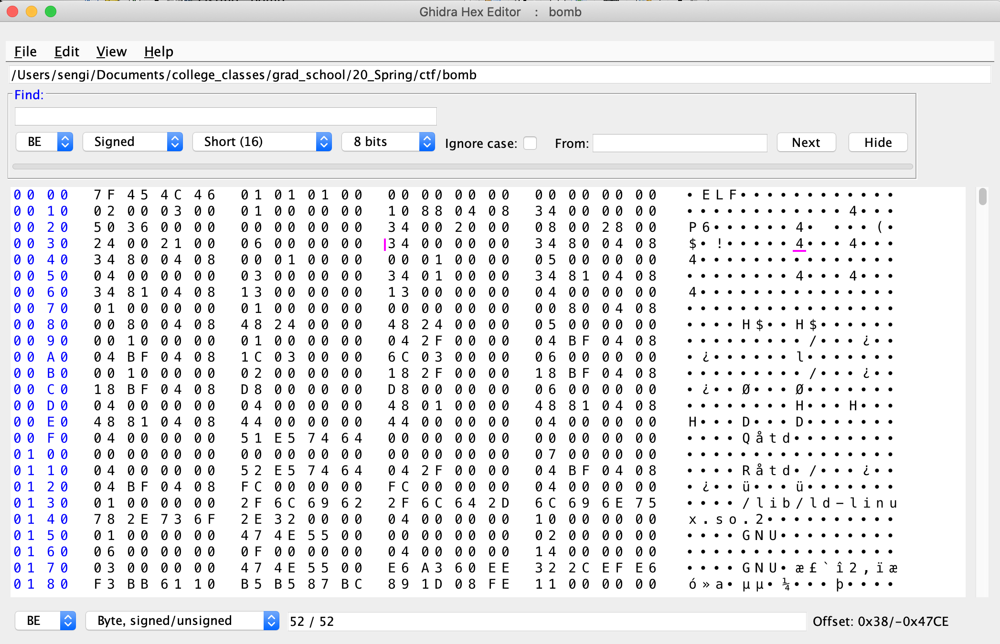
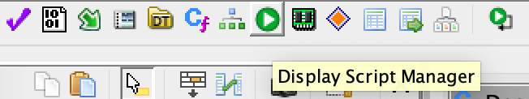
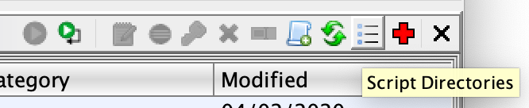
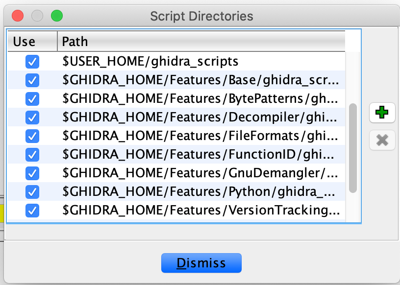

# Ghidra-HexEditor
A Hex Editor implemented as a Ghidra Plugin
> much of the original source code is forked from https://github.com/javadev/hexeditor

## Installation and Setup:

1. Clone the repository from Github

   `git clone https://github.com/sengi12/ghidra-hexEditor.git`

2. Install the latest version of Ghidra

   1. Download from: [https://ghidra-sre.org](https://ghidra-sre.org/)
   2. Refer to the Ghidra Installation Guide: https://ghidra-sre.org/InstallationGuide.html

3. Open Ghidra and start a new Project

4. Map the Script Manager to your `ghidra-hexEditor` repo

   1. Click the green play button in the task bar (script manager)

      

   2. Click on the icon called "script directories" when hovered over

      

   3. Click the green `+` (plus sign) and add the ghidra-hexEditor directory to the list

      

5. Run HexEditor for testing

   1. Filter the script manager for `HexEditor.java`. 
   2. Highlight the file and click the green play button

> You can also assign a key binding to HexEditor.java by right clicking on the plugin. ( I prefer ALT-H )
