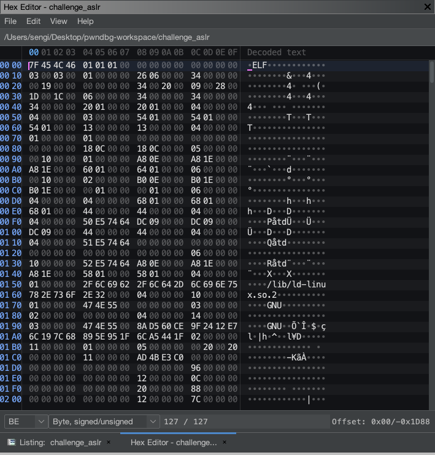
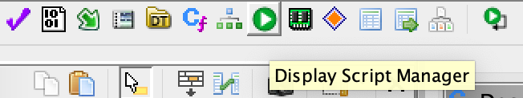
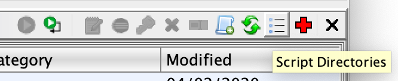
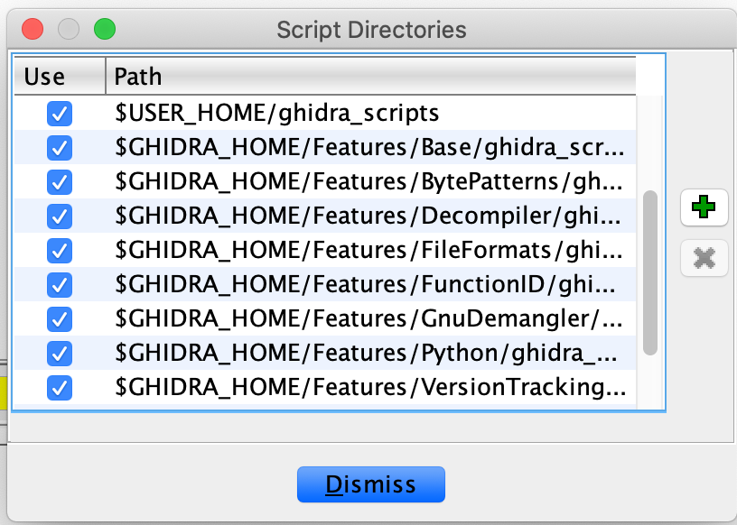

# Ghidra-HexEditor
A Hex Editor implemented as a Ghidra Plugin
> much of the original source code is forked from https://github.com/javadev/hexeditor

## Installation and Setup:

1. Clone the repository from Github

   `git clone https://github.com/sengi12/ghidra-hexEditor.git`

2. Install the latest version of Ghidra

   1. Download from: [https://ghidra-sre.org](https://ghidra-sre.org/)
   2. Refer to the Ghidra Installation Guide: https://ghidra-sre.org/InstallationGuide.html

3. Open Ghidra and start a new Project

4. Map the Script Manager to your `ghidra-hexEditor` repo

   1. Click the green play button in the task bar (script manager)

      

   2. Click on the icon called "script directories" when hovered over

      

   3. Click the green `+` (plus sign) and add the ghidra-hexEditor directory to the list

      

5. Run HexEditor for testing

   1. Filter the script manager for `HexEditor.java`. 
   2. Highlight the file and click the green play button

> You can also assign a key binding to HexEditor.java by right clicking on the plugin. ( I prefer ALT-H )

## The editor window

The editor opens as a **dockable Ghidra window**, so it tabs and splits alongside the Listing and the Decompiler and Ghidra remembers where you put it between sessions. Re-running the script on the same program reuses its window instead of stacking up another tab.

If the script is run without a tool, it falls back to a standalone window sized to its own content and centered on screen.

## Theme

The editor follows whatever theme Ghidra is wearing - it reads the current look and feel and matches it, so a dark Ghidra gets a dark hex editor with no setup. Ghidra's own setting lives under **Edit -> Tool Options -> Tool -> Swing Look And Feel**; picking one of the *Flat* themes there gets you a consistently themed tool, this editor included.

To override that, use **View -> Toggle Dark Mode** or **Ctrl-W**. A theme you pick by hand wins over the host from then on and is remembered the next time you open the editor.

Only the editor's own components are recolored; Ghidra's look and feel is left untouched. On look and feels that paint their own controls (macOS Aqua, for example) a few widgets such as combo boxes keep their native colors.

## Keys

| | |
|---|---|
| `Ctrl-F` | open the find bar |
| `Esc` | close the find bar |
| `Ctrl-W` | toggle dark mode |
| `Ctrl-+` / `Ctrl--` | grow or shrink the byte grid |
